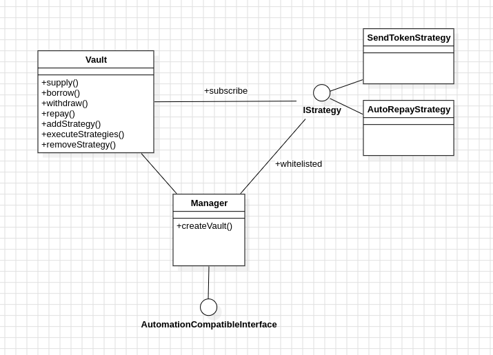

# VaultFolio contract

The main entry point will be the `Manager.sol` that will be in charge of the vault creation. When a user creates a new vault, he will deploy a new smart contract called `Vault.sol` and will be the only owner of it.

The Vault contract acts as an intermediate layer between the liquidity provider (here AAVE) and the user, allowing to isolate the liquidity and thus the collateral. 

To extend the capabilities of the Vault, we have added the possibility to provide automated action inside a vault. The user can then choose to attach strategy on a vault by providing the requirement and the type of action. At the moment, we are working on the `SendTokenStrategy.sol`, which allow to use the yield of a token to buy another asset as BTC depending of predefined allocation. The vault can subscribe to a strategy that must be whitelisted by the Manager. And the Manager will be in charge of calling the different strategies when they are ready. To provide the automation, we are relying on the ChainLink Automation services.


## Architecture Overview




## Scroll Sepolia Deployment Address

Manager contract: `0x2a323ef5e2ace57c1d885360558f72257F415d41`
> https://scroll-sepolia.blockscout.com/address/0x2a323ef5e2ace57c1d885360558f72257F415d41

Send Token Strategy: `0x27b50ED9cd94e2c7aBCDc237c160c497F8D5b042`
> https://scroll-sepolia.blockscout.com/address/0x27b50ED9cd94e2c7aBCDc237c160c497F8D5b042


## Helpful command

### Lint

```shell
$ solhint 'src/**/*.sol'
```

### Build

```shell
$ forge build
```

### Test

```shell
$ forge test
```

### Format

```shell
$ forge fmt
```

### Deploy

Update your `.env` file.

```shell
$ ./deploy.sh
```
